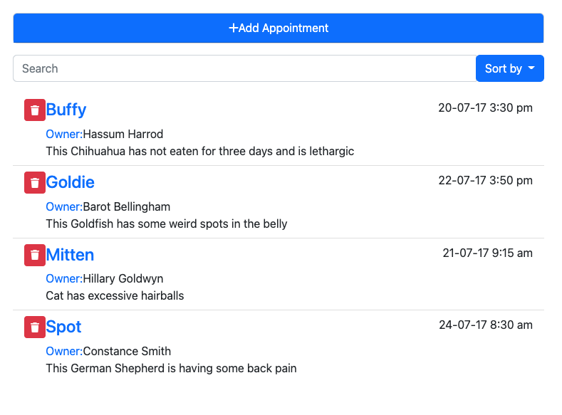

<!-- PROJECT TITLE -->
 

<h2 align="center">Building an Interface</h3>

 Linkedin course by Ray Villalobos

 

 

## About the project

I've followed this LinkedIn <a href="https://www.linkedin.com/learning/vue-js-building-an-interface-2?contextUrn=urn%3Ali%3AlyndaLearningPath%3A5d94ce0a498e93731fbb8711">course</a> offered by Ray Villalobos.
It teaches how to build a simple component-based app: an appointment booking and management system with features for searching and sorting.
 
Ray Villalobos shows how to use Vue.js components and subcomponents; build forms; create, update, and delete data; and manage events.

I am on my way to achieve a :rocket: fullstack overview!

 

 

## Built with

Major frameworks/libraries used:

- Vue
- Babel
- Bootstrap
- Fontawesome
- Axios
- Lodash
- Moment
- Popper

 

## Author

I'm Marta Boteller, little more about me at my [website](https://martaboteller.com).

   

## Acknowledgments

This course was prepared with older versions of Vue, Bootstrap & Fontawesome. Minor changes have been implemented now.
  I would like to thank <a href="https://www.linkedin.com/learning/vue-js-building-an-interface-2?contextUrn=urn%3Ali%3AlyndaLearningPath%3A5d94ce0a498e93731fbb8711">Ray Villalobos </a>for his fantastic way of teaching!

##
